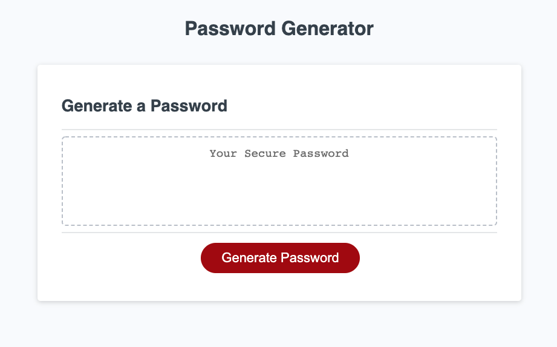

Task was to build a random password generator with values that we choose,
had to write the Javascript, HTML & CSS was given pior. 
Give a list of prompted questions you must choose, the length, and what characters you want
to include. 
Genterate button will deploy a password with the length you choose and the random character values. 

I learned how to create a for loop for a single output. 
I learned how to combine arrays into a single array.
I had to check my varibles if they were true in order to work.

live link 
https://l-stew206.github.io/password-generator/

repo link
https://github.com/L-Stew206/password-generator